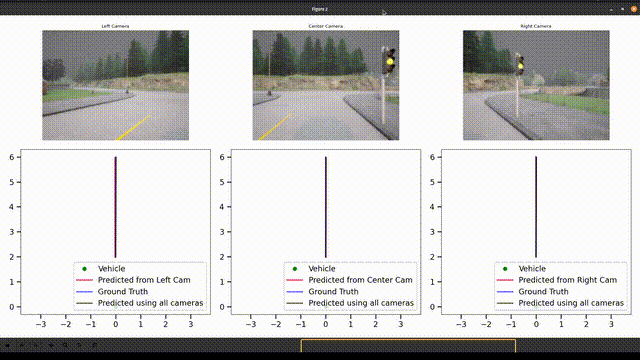

## Interpretable Autonomy: Using Mixture-of Experts for End-to-End Self-Driving

#### Usage:
1. Recording Data
   
Run `src/carla_record.py viz` to record a dataset with live visualizations, omit `viz` to run headless. You will need an instance of CARLA simulator running on the same computer.

2. Model Definitions
   
Models are defined in `src/models.py`. Relevant ones are WaypointNet and MultiCamWaypointNet (MoE coming soon).

3. Training Script
   
See `src/train.py` for the training script and arguments. Currently batchsize is set to 1 which may limit training speed.

4. Evaluation
   
Run `carla_model_test.py viz` to see evaluation of trained models in CARLA (closed-loop eval). Omitting `viz` will print a dictionary of failure events (crashes, invalid generated waypoints) to stdout after 100,000 steps of the simulation. For open-loop evaluation, see the entrypoint to `src/utils.py waypoint`.

